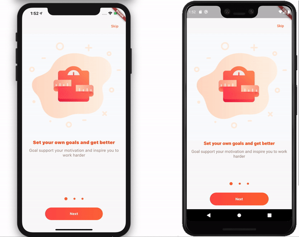

# OnBoard Screen For Flutter

An awesome OnBoard ui for both android and ios



## Installing

```yaml
dependencies:
  flutter_onboard: ^0.1.0
```

## Basic Usage

```dart
import 'package:flutter_onboard/flutter_onboard.dart';
```

```dart
OnBoard(
    onBoardData: onBoardData ,
    pageController: pageController,
    onSkip: () {
      print('skipped');
    },
    onDone: () {
      print('done tapped');
    },
)
```

## OnBoardModel Example:

```dart
final List<OnBoardModel> onBoardData = [
  OnBoardModel(
    title: "Set your own goals and get better",
    description: "Goal support your motivation and inspire you to work harder",
    imgUrl: "assets/images/weight.png",
  ),
  OnBoardModel(
    title: "Track your progress with statistics",
    description:
        "Analyse personal result with detailed chart and numerical values",
    imgUrl: 'assets/images/graph.png',
  ),
  OnBoardModel(
    title: "Create photo comparisons and share your results",
    description:
        "Take before and after photos to visualize progress and get the shape that you dream about",
    imgUrl: 'assets/images/phone.png',
  ),
];
```

## Custom Usage

| Properties           | Required | Description                                                                            |
| -------------------- | -------- | -------------------------------------------------------------------------------------- |
| `onBoardData`        | true     | `[List<OnBoardModel>]` Data for OnBoard                                                |
| `onSkip`             | true     | `[VoidCallback]`, when skip action performed                                           |
| `onDone`             | true     | `[VoidCallback]`, when done action performed                                           |
| `titleStyles`        | false    | `[TextStyles]`, used to style title text                                               |
| `descriptionStyles`  | false    | `[TextStyles]`, used to style description text                                         |
| `imageWidth`         | false    | `[double]` OnBoard Image width                                                         |
| `imageHeight`        | false    | `[double]` OnBoard Image height                                                        |
| `skipButton`         | false    | `[Widget]` custom skip button                                                          |
| `nextButton`         | false    | `[Widget]` custom next/done button                                                     |
| `pageController`     | true     | `[PageController]` controller for PageView                                             |
| `duration`           | false    | `[Duration]` Animation Duration of one screen to another                               |
| `curve`              | false    | `[Curve]` Animation Curve of one screen to another                                     |
| `pageIndicatorStyle` | false    | `[PageIndicatorStyle]` Configure width, size, active & inactive color of pageIndicator |

## Custom Usage Example:

> Note: for custom usage in order to access [`OnBoardState`] example uses `provider` package

```dart
import 'package:flutter/material.dart';
import 'package:flutter_onboard/flutter_onboard.dart';
import 'package:provider/provider.dart';

void main() {
  runApp(App());
}

class App extends StatelessWidget {
  @override
  Widget build(BuildContext context) {
    return MaterialApp(
      home: HomeScreen(),
    );
  }
}

class HomeScreen extends StatelessWidget {
  final PageController _pageController = PageController();
  @override
  Widget build(BuildContext context) {
    return Provider<OnBoardState>(
      create: (_) => OnBoardState(),
      child: Scaffold(
        body: OnBoard(
          pageController: _pageController,
          onSkip: () {
            print('skipped');
          },
          onDone: () {
            print('done tapped');
          },
          onBoardData: onBoardData,
          titleStyles: TextStyle(
            color: Colors.deepOrange,
            fontSize: 18,
            fontWeight: FontWeight.w900,
            letterSpacing: 0.15,
          ),
          descriptionStyles: TextStyle(
            fontSize: 16,
            color: Colors.brown.shade300,
          ),
          pageIndicatorStyle: PageIndicatorStyle(
            width: 100,
            inactiveColor: Colors.deepOrangeAccent,
            activeColor: Colors.deepOrange,
            inactiveSize: Size(8, 8),
            activeSize: Size(12, 12),
          ),
          skipButton: FlatButton(
            onPressed: () {
              print('skipped');
            },
            child: Text(
              "Skip",
              style: TextStyle(color: Colors.deepOrangeAccent),
            ),
          ),
          nextButton: Consumer<OnBoardState>(
            builder: (BuildContext context, OnBoardState state, Widget child) {
              return InkWell(
                onTap: () => _onNextTap(state),
                child: Container(
                  width: 230,
                  height: 50,
                  alignment: Alignment.center,
                  decoration: BoxDecoration(
                    borderRadius: BorderRadius.circular(30),
                    gradient: LinearGradient(
                      colors: [Colors.redAccent, Colors.deepOrangeAccent],
                    ),
                  ),
                  child: Text(
                    state.isLastPage ? "Done" : "Next",
                    style: TextStyle(
                      color: Colors.white,
                      fontWeight: FontWeight.bold,
                    ),
                  ),
                ),
              );
            },
          ),
        ),
      ),
    );
  }

  void _onNextTap(OnBoardState onBoardState) {
    if (!onBoardState.isLastPage) {
      _pageController.animateToPage(
        onBoardState.page + 1,
        duration: Duration(milliseconds: 250),
        curve: Curves.easeInOutSine,
      );
    } else {
      print("done");
    }
  }
}

final List<OnBoardModel> onBoardData = [
  OnBoardModel(
    title: "Set your own goals and get better",
    description: "Goal support your motivation and inspire you to work harder",
    imgUrl: "assets/images/weight.png",
  ),
  OnBoardModel(
    title: "Track your progress with statistics",
    description:
        "Analyse personal result with detailed chart and numerical values",
    imgUrl: 'assets/images/graph.png',
  ),
  OnBoardModel(
    title: "Create photo comparisons and share your results",
    description:
        "Take before and after photos to visualize progress and get the shape that you dream about",
    imgUrl: 'assets/images/phone.png',
  ),
];


```

for more info check [example](example)

## TODO

- Add more custom page indicators.

- Dynamic calculation of width, height, padding, margin.

- Writing tests

> Need more features feel free to raise an issue

## License

This project is licensed under the MIT - see the [LICENSE](LICENSE) file for details
